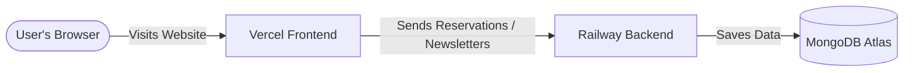

# ☕ Cafeca — Premium Luxury Café & Reservation Sanctuary

Welcome to **Cafeca**, an ultra-premium, modern, and immersive café website designed for coffee enthusiasts who appreciate slow dining, minimalist design, and elegant aesthetics. 

Live-engineered with high-fidelity glassmorphism, responsive grid animations, an AI-powered concierge assistant, and a high-performance reservation system connected directly to a MongoDB Atlas cloud database.

---

## 🗺️ System Architecture



---

## ✨ Signature Features

### 💎 Ultra-Premium UI/UX
* **High-Contrast Dark Mode & Premium Typography**: Styled using preconnected *Playfair Display* and *Inter* fonts for a classic Italian boutique feel.
* **Glassmorphic Reservation Form**: Beautiful overlay overlays with native calendar date pickers and programmatic click actions for ease of use.
* **Auto-Timer Success Popup Toast**: An elegant, glassmorphic success overlay (`bg-white/95 backdrop-blur-md`) that pops up for exactly 3 seconds to greet the guest after database storage success.

### 🧠 Smart Features
* **AI Concierge Chatbot**: A fully responsive, intelligent AI chatbot equipped to guide guests through the premium drink selections, locate the Delhi Hauz Khas sanctuary, and redirect them to booking channels.
* **100% Mobile & Tablet Responsive**: Customized grid columns, flexible containers, and responsive paddings for seamless execution on any viewport size.

### 🛡️ Production Security & Architecture
* **Safe Keys Framework**: Custom `.gitignore` directives configured at all repository levels to ensure backend secrets and Mongo Atlas cloud keys (`.env` files) never leak into version control.
* **Vercel Client Routing Fixes**: Custom `vercel.json` rewrite mappings installed directly inside the frontend root to prevent `404 Not Found` errors when directly visiting or reloading standalone routes like `/contact` and `/about`.
* **Exposed PORT Binding**: Express backend dynamically binds to `process.env.PORT` to ensure zero-config deployment on platforms like Railway.

---

## 🛠️ Technology Stack

* **Frontend**: React (Vite), Tailwind CSS, Lucide / Phosphor Icons, Axios, React Router.
* **Backend**: Node.js, Express, Cors, Dotenv, Mongoose.
* **Database**: MongoDB Atlas Cloud Cluster.
* **Hosting**: Vercel (Frontend), Railway (Backend).

---

## 🚀 Local Development Setup

### 1. Backend Server Setup
1. Navigate to the backend directory:
   ```bash
   cd backend
   ```
2. Install the server-side dependencies:
   ```bash
   npm install
   ```
3. Configure your local `.env` variables:
   ```env
   MONGODB_URI=your_mongodb_connection_string
   PORT=5000
   ```
4. Boot up the server:
   ```bash
   npm start
   ```

### 2. Frontend App Setup
1. Navigate to the frontend directory:
   ```bash
   cd ../frontend
   ```
2. Install the client-side dependencies:
   ```bash
   npm install
   ```
3. Boot up the Vite dev server:
   ```bash
   npm run dev
   ```
4. Access the web app locally at **`http://localhost:5173`**.

---

## 🌍 Production Deployments

Follow the detailed **[deployment_guide.md](./deployment_guide.md)** artifact created inside this repository to launch:
1. Your backend API server live on **Railway**.
2. Your interactive frontend SPA live on **Vercel**.
